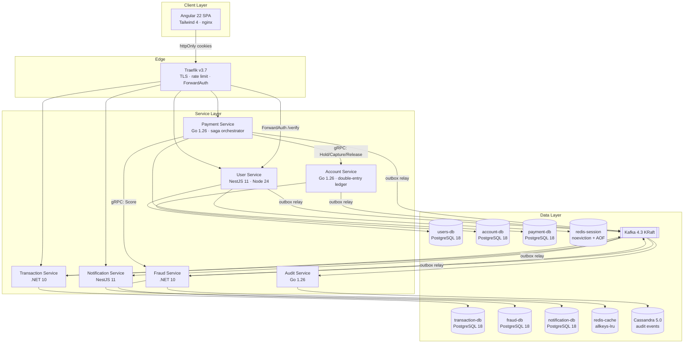

# peikonpurekkusu — Target Architecture

Corrected architecture derived from the original vision (see
[architecture-review.md](architecture-review.md)) and the 2026-07-06 technology research
sweep. Every version below was verified current as of that date.

---

## 1. System overview



The two core rules that shape everything:

1. **Synchronous, user-waiting decisions travel over gRPC with deadlines** (fraud score,
   funds hold/capture). **Facts travel over Kafka via transactional outboxes** (payment
   captured, transaction recorded, notify user, audit).
2. **Money truth lives only in PostgreSQL ledgers.** Redis caches are for display;
   holds/balances are decided inside DB transactions.

## 2. Service catalog

| Service | Stack | Sync API | Async | Owns |
|---|---|---|---|---|
| user-service | NestJS 11.1 / Node 24 / pnpm 11 | REST `/auth/*`, `/users/*`, `/verify` (ForwardAuth), `/.well-known/jwks.json` | outbox → `identity.*` | users-db, redis-session |
| account-service | Go 1.26 / pgx 5.10 / sqlc 1.31 | gRPC `Hold/Capture/Release/GetBalance` + REST reads | outbox → `accounts.*`; consumes `payments.*` (release on failure) | account-db |
| payment-service | Go 1.26 | REST `/payments` (idempotent), SSE status | outbox → `payments.*`; consumes `gateway.*` | payment-db |
| transaction-service | .NET 10 / EF Core 10 | REST `/transactions` (queries) | consumes `payments.payment.captured.v1` etc.; outbox → `transactions.*` | transaction-db |
| fraud-service | .NET 10 | gRPC `Score` (150 ms deadline) | consumes `payments.*` (deep analysis); outbox → `fraud.*` | fraud-db, redis-cache (velocity counters) |
| notification-service | NestJS 11.1 | SSE/WebSocket push | consumes `payments.*`, `fraud.*`, `identity.*` | notification-db |
| audit-service | Go 1.26 | health only | consumes `*.v1` firehose | Cassandra keyspace `audit` |
| frontend | Angular 22 / Tailwind 4.3 / nginx-unprivileged | — | — | — |

**Mock PSP:** the external gateway/processor (Visa/Mastercard/PayPal-style) is a small
in-repo mock service the payment-service adapters call over HTTP, with configurable
latency/failure/decline rates — this is what the circuit breaker exercises.

## 3. Money model (account-service)

Schema (integer minor units everywhere, ISO-4217 exponent table drives interpretation):

```
accounts(id UUID PK, user_id, currency CHAR(3), type ENUM(asset,liability,revenue,expense,equity), status, created_at)
ledger_transactions(id UUID PK, idempotency_key UNIQUE, kind, state, created_at)      -- no UPDATE/DELETE grants
ledger_entries(id, transaction_id FK, account_id FK, direction ENUM(debit,credit),
               amount BIGINT CHECK (amount > 0), currency CHAR(3), created_at)         -- append-only
account_balances(account_id PK, available BIGINT, held BIGINT, version BIGINT,
                 CHECK (available >= 0), CHECK (held >= 0))                            -- derived, rebuildable
holds(id UUID PK, account_id, payment_id, amount BIGINT, status ENUM(active,captured,released,expired),
      expires_at, created_at)                                                          -- two-phase pending transfers
```

Invariants enforced in one serializable DB transaction per posting:
SUM(debits)=SUM(credits) per ledger_transaction; `account_balances` updated in the same
transaction (optimistic `version`); hold → capture posts final entries, hold → release
restores availability; an expiry sweeper releases stale holds (card-auth style, 7-day
default). A reconciliation job re-derives balances from entries and alerts on drift.

## 4. Payment saga (payment-service, orchestrated)

State machine persisted per payment (PaymentIntent-style):

```
REQUESTED → FRAUD_SCREENED → FUNDS_HELD → SUBMITTED_TO_GATEWAY → CAPTURED → RECORDED → NOTIFIED
     ↘ DECLINED(fraud)   ↘ INSUFFICIENT_FUNDS   ↘ GATEWAY_FAILED → REVERSED (compensation: release hold)
Client-facing status: requires_action | processing | succeeded | failed | canceled | refunded
```

- **Idempotency (Stripe model):** `Idempotency-Key` header required on POST `/payments`;
  `idempotency_keys(key, user_id, request_hash, response_code, response_body, recovery_point,
  locked_at, UNIQUE(user_id,key))` with ≥24 h TTL; same key + different payload → 409/422;
  responses cached once execution begins (including 5xx); recovery points make the
  multi-step handler resumable.
- **Inline fraud:** gRPC `Score` with 150 ms deadline; amount-tiered policy on timeout
  (small amounts fail-open, large fail-closed / step-up).
- **Hold:** gRPC to account-service inside the saga; compensation is `Release`.
- **Gateway:** adapter per PSP (strategy + adapter patterns) with retry + exponential
  backoff + jitter and a circuit breaker; gateway calls carry our idempotent
  `payment_id` as the PSP reference.
- **FX:** payment stores `fx_quote_id, rate, quoted_at, expires_at` captured at quote
  time from the append-only `exchange_rates` table (single direction per pair; inverses derived).
- **Facts via outbox:** every state transition writes `payment-db.outbox` in the same
  transaction; a polling relay (`FOR UPDATE SKIP LOCKED`) publishes to Kafka.
  (Debezium 3.6 CDC is the documented scale-up path; polling keeps the one-command
  compose light.)

## 5. Kafka backbone

- **Image:** `apache/kafka:4.3.1` (KRaft only — ZooKeeper is gone in 4.x). Dev profile:
  1 combined-mode broker. HA profile: 3 brokers, offsets/transaction-state RF=3,
  `min.insync.replicas=2`.
- **Topics:** `<domain>.<aggregate>.<event>.v1`, lowercase dots, key = aggregate id
  (per-payment ordering). Catalog: `payments.payment.{requested,authorized,captured,failed,reversed}.v1`,
  `accounts.funds.{held,captured,released}.v1`, `transactions.transaction.recorded.v1`,
  `fraud.score.{approved,denied,flagged}.v1`, `identity.user.{registered,session_revoked}.v1`,
  `notifications.notification.{requested,delivered,failed}.v1`.
- **Consumers:** idempotent (processed-event table in consumer DB, same tx as the business
  write); bounded retries → per-group DLQs `<group>.<topic>.dlq` with failure-metadata
  headers; poison pills quarantined, never looped.
- **Producers:** `enable.idempotence=true`, `acks=all` (defaults since Kafka 3.0).
  `isolation.level=read_committed` where transactional topics exist.
- **Envelope:** every event carries `event_id (UUIDv7), occurred_at, correlation_id
  (W3C traceparent-derived), causation_id, idempotency_key, schema_version`. Contracts are
  versioned JSON Schema files in `contracts/events/` (registry-free; Apicurio noted as
  the upgrade path — Confluent Schema Registry avoided for licensing).

## 6. Security architecture (JWT theft protection)

- **Signing:** ES256 (Azure Key Vault–compatible; Ed25519 still unsupported there),
  private key held only by user-service; `/.well-known/jwks.json` with `kid` rotation
  (new key published before use; old kept until last token expires). All verifiers pin
  `alg` allow-list, validate `iss`/`aud`/`exp`/`nbf`, reject `jku/jwk/x5u/x5c`.
- **Tokens:** access 10 min with `jti` (UUID); refresh single-use, rotated per RFC 9700,
  stored as **hashes** in users-db with `family_id` + generation; **reuse of a consumed
  refresh token revokes the whole family** and emits `identity.user.session_revoked.v1`
  (theft signal). Atomic rotation with short grace window (parallel-tab race).
- **Browser storage:** none. BFF stance — `__Host-` prefixed `httpOnly; Secure` cookies:
  access cookie `SameSite=Lax` (3DS-style top-level returns), refresh cookie
  `SameSite=Strict; Path=/auth/refresh`. CSRF double-submit token for mutating calls.
  Angular never sees a token.
- **Revocation:** Redis (`redis-session`, `noeviction` + AOF) denylist
  `revoked:jti:<jti>` with TTL = remaining life, plus per-user session index
  `user:<id>:sessions` for revoke-all. **Fail closed** on Redis unavailability.
- **Gateway enforcement:** Traefik ForwardAuth → user-service `/verify` (JWKS + denylist
  + session binding check), whitelisted response headers `X-User-Id, X-User-Roles`
  forwarded to services; services on the internal network trust only these.
- **Session binding:** session record stores device-fingerprint hash + coarse IP;
  material change at refresh → step-up (fresh `auth_time`/`amr` required). High-risk
  operations (large amount, new payee, fraud flag) demand recent `auth_time` regardless.
- **Passwords:** Argon2id (node-argon2 0.44 defaults: 64 MiB, t=3 — RFC 9106-aligned),
  `needsRehash()` upgrade on login.
- **PCI stance:** raw PAN/CVV never enters the system (mock PSP tokenizes; we store
  token + brand + last4 + expiry only) — SAQ-A shaped scope.

## 7. Redis roles (two instances — eviction policies conflict)

| Instance | Policy | Contents |
|---|---|---|
| redis-session | `noeviction` + AOF `everysec` | sessions, jti denylist, refresh-family index, CSRF secrets |
| redis-cache | `allkeys-lru`, no persistence | display-only balance cache (1–5 s TTL, delete-on-write), fraud velocity counters, rate-limit state |

Never authorize a debit from cache; never place a "lock" for money in Redis
(locks are efficiency-only; correctness is DB rows + unique constraints).

## 8. Audit (Cassandra 5.0)

`audit.events((tenant_id, day), event_id timeuuid)` with `CLUSTERING ORDER BY (event_id DESC)`,
TimeWindowCompactionStrategy (1-day windows), table-level `default_time_to_live`,
LOCAL_QUORUM writes, client-generated timeuuid (idempotent retries), SAI index for
entity lookups. audit-service consumes the full `*.v1` firehose. The sink is an
interface: `AUDIT_SINK=cassandra|postgres`. **Default in dev compose is `postgres`**
(append-only partitioned table in audit-db): Cassandra 5 needs ~2 GB of Docker-VM
headroom, so it is profile-gated (`COMPOSE_PROFILES=cassandra`) rather than
force-started — the honest tradeoff at this scale anyway. Production floor for the
Cassandra path is 3 nodes/RF=3.

## 9. Design-pattern placement (mandated patterns)

| Pattern | Where |
|---|---|
| Strategy | PSP processor selection per payment method; MFA channel; notification channel; fraud timeout policy per amount tier |
| Adapter | Each PSP client normalized to the `PaymentProcessor` port; audit sink (Cassandra/Postgres) |
| Chain of Responsibility | Fraud rule pipeline (velocity → amount tier → geo/device → denylist → model score) |
| Mediator | .NET in-process command/handler dispatch (plain-DI mediator — MediatR v13 licensing avoided); saga orchestrator mediating service interactions |
| Facade | `PaymentsFacade` over saga internals; `LedgerFacade` over posting rules; NestJS `AuthFacade` over token/session/MFA subsystems |
| Factory | JWT/key factories (kid rotation), event-envelope factory, processor factory (method → strategy), DLQ publisher factory |
| State | Payment saga state machine with explicit transitions |
| Outbox / Saga / Idempotency-Key / Circuit Breaker / Retry | as described above (gobreaker + backoff in Go, Polly in .NET, built-ins in Nest) |

## 10. Observability

OpenTelemetry everywhere → OTLP collector (compose profile): Go otel SDK 1.42
(⚠ metrics cardinality cap 2000/instrument — never label by account_id), .NET
`OpenTelemetry.*` 1.16 + Npgsql.OpenTelemetry, Node `@opentelemetry/sdk-node`.
W3C traceparent propagated HTTP → gRPC → Kafka headers → consumers. Structured JSON
logs to stdout. `/health/live` (process only) vs `/health/ready` (deps) on every
service — readiness gates compose startup and maps to Azure Container Apps probes.

## 11. Deployment shape

- **Local:** Docker Compose, all images multistage
  (Go → `distroless/static-debian12:nonroot`; NestJS → `node:24-alpine` + pnpm deploy;
  .NET → `aspnet:10.0-noble-chiseled`; Angular → `nginx-unprivileged:alpine`).
  Two networks: `edge` (Traefik ↔ service fronts) and `internal` (services ↔ data).
  Only Traefik publishes host ports. `exposedByDefault=false`; docker.sock read-only.
- **Azure path** (docs/azure.md): services → Container Apps (min replicas ≥1 on hot
  paths), Kafka → Event Hubs Standard (Kafka endpoint, SASL_SSL/OAUTHBEARER — client
  config already env-driven), PostgreSQL → Flexible Server PG18 zone-redundant,
  Redis → **Azure Managed Redis** (Azure Cache for Redis is retiring), Cassandra →
  Managed Instance for Apache Cassandra (not Cosmos), secrets → Key Vault + per-service
  user-assigned managed identities, images → ACR. Compose is deliberately 12-factor
  (env-only config, one port per service, health endpoints, stdout logs) so
  `az containerapp compose create` / azd can lift it.

## 12. Version pins (verified 2026-07-06)

| Tech | Version | Notes |
|---|---|---|
| Go | 1.26.x (toolchain 1.26.4) | Green Tea GC default |
| pgx / sqlc / chi | 5.10.0 / 1.31.1 / 5.3.0 | pgx ≥5.9 mandatory (CVE-2026-33816); chi 5.3 fixes RealIP spoofing |
| franz-go | latest 1.2x | pure Go — keeps distroless/static builds |
| NestJS / Node / pnpm | 11.1.x / 24 LTS / 11.10 | kafkajs unmaintained → @confluentinc/kafka-javascript 1.10 |
| argon2 / jose | 0.44.0 / 6.2.3 | pnpm `onlyBuiltDependencies` for native builds |
| .NET / EF Core / Npgsql provider | 10.0 LTS / 10 / 10.0.2 | .NET 8 & 9 both die 2026-11-10 |
| Confluent.Kafka (.NET) | 2.15.0 | KIP-848 ready |
| Angular / Tailwind | 22.0.x / 4.3.2 | zoneless default; PostCSS path, not Vite plugin |
| Traefik | v3.7 | v3 label syntax |
| Kafka | apache/kafka:4.3.1 | KRaft only |
| PostgreSQL | postgres:18.4-alpine | ⚠ volume path is `/var/lib/postgresql` in 18+ images |
| Redis | redis:8.8-alpine ×2 instances | Valkey 9.1 is the BSD drop-in if licensing policy requires |
| Cassandra | 5.0.8 | gocql moved → apache/cassandra-gocql-driver/v2 v2.1.2 |
| Schema registry | Apicurio 3.3.0 (ccompat/v7) | Apache-2.0; Confluent wire format; JSON Schema |
| MikroORM (Nest persistence) | 7.1.5 (+ @mikro-orm/nestjs 7.0.2) | UoW → outbox in one tx; TS nodenext |
| goose (Go migrations) | 3.27.2 embedded | pg advisory-lock guarded startup migration |
| golang-jwt + keyfunc | 5.3.1 / v3 | JWKS auto-refresh cache |
| Microsoft.IdentityModel / JwtBearer | 8.19.1 / 10.0.9 | auto JWKS refresh-on-unknown-kid |
| Redis clients | go-redis 9.21 · node-redis 6.1 · SE.Redis 3.0.11 | RESP3 default across all three |
| Debezium (upgrade path only) | 3.6.0.Final | documented, not in default compose |
